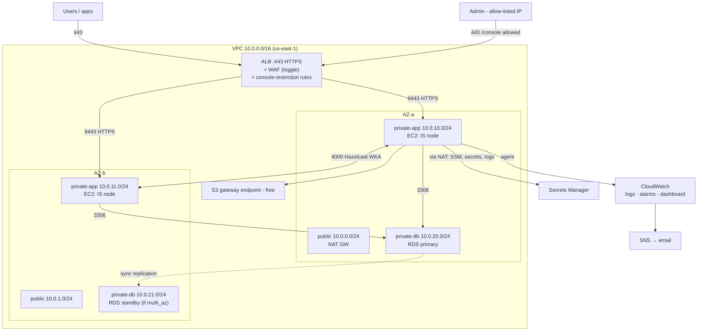

# Architecture

WSO2 Identity Server 7.3, highly available across two AZs, on AWS, in Terraform.

## Request / data flows

- **Login:** user → ALB (443, sticky) → IS node (9443) → checks user store in **RDS**
  → returns OIDC token. Both nodes share RDS, so either can serve any request.
- **Admin:** `/console`, `/carbon`, `/api/server/*` only forwarded if the source IP is
  `admin_cidr`; otherwise the ALB returns a fixed 403. Everyone else's login/OIDC/SCIM
  traffic stays public.
- **Clustering:** nodes find each other via `ec2:DescribeInstances` (tag `Cluster`) at
  boot and gossip over port 4000 (WKA) - used for cache invalidation + a coordinator
  role, *not* data replication (data lives in RDS). See ADR-005.
- **Secrets:** nodes fetch DB + admin creds from Secrets Manager at boot; nothing
  sensitive is in the repo or the AMI.
- **Observability:** the CloudWatch agent ships `wso2carbon.log`, `audit.log`, and
  access logs; metric filters + alarms watch for error spikes, failed-login bursts,
  5xx, unhealthy targets, and RDS CPU, paging an SNS email topic.

## Security layers (defense in depth)

1. **NACLs** - coarse per-subnet-tier isolation (DB tier sealed from the internet).
2. **Security groups** - fine-grained: ALB←internet:443, node←ALB:9443, RDS←node:3306,
   least-privilege egress.
3. **ALB listener rules** - admin console restricted to `admin_cidr`.
4. **WAF** (toggle) - managed rule sets + per-IP rate limit.
5. **WSO2** - account lockout, admin auth, audit logging.

Proven together in the Phase 8 attack demo (`docs/demos/attack-defense.md`).

## Operational runbook

| Task | How |
|---|---|
| **Bring it up** | `cd terraform && terraform apply` (~10 min; installers cached in S3) |
| **Tear it down ($0)** | `terraform destroy` |
| **Pause compute, keep data** | `terraform apply -var="is_node_count=0"` → resume with `=2` |
| **Destroy but keep DB** | `apply` with `db_skip_final_snapshot=false` + `db_final_snapshot_identifier=NAME` **first**, then `destroy`; restore via `db_snapshot_identifier=NAME` |
| **Admin IP changed** (403 on console) | update `admin_cidr` in `terraform.tfvars`, `apply` |
| **Run the attack demo** | `apply -var="enable_waf=true"`, then `scripts/demos/credential-stuffing.sh` |
| **Failover test** | `apply -var="db_multi_az=true"`, reboot-with-failover, then back to `false` |
| **Shell into a node** | EC2 console → Connect → Session Manager (no SSH) |
| **Get admin password** | `aws secretsmanager get-secret-value --secret-id wso2is/admin --query SecretString --output text` |
